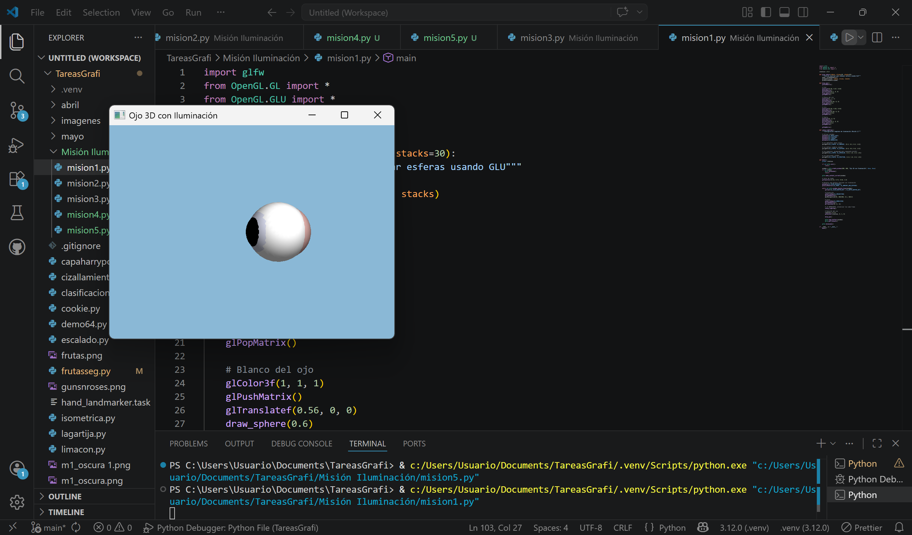
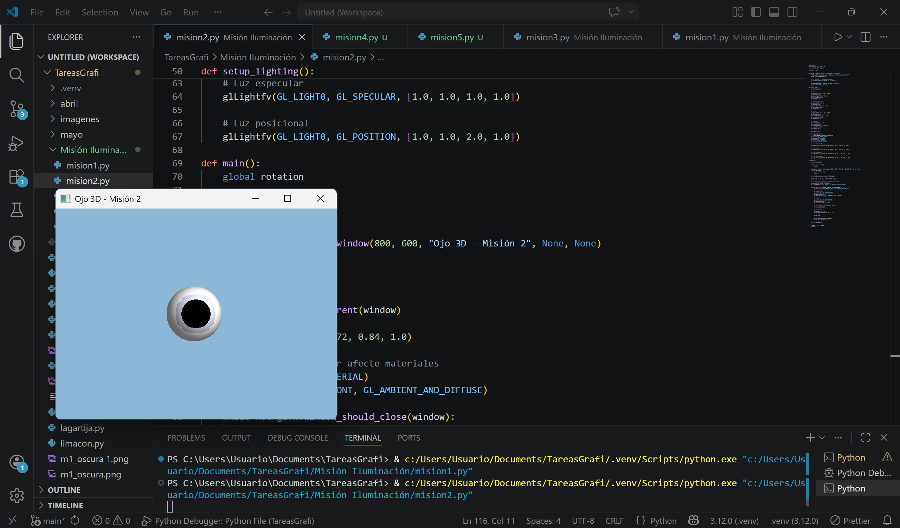
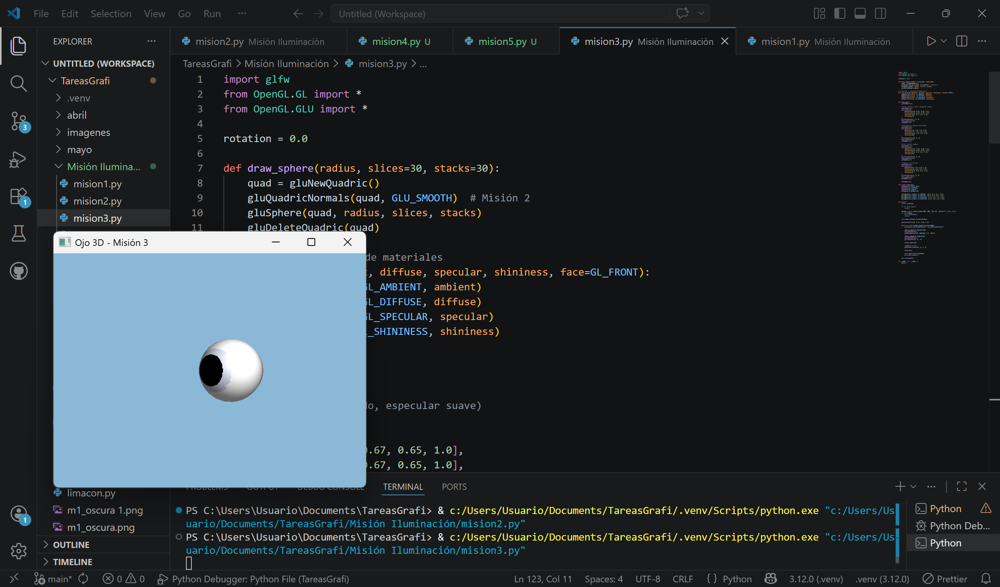
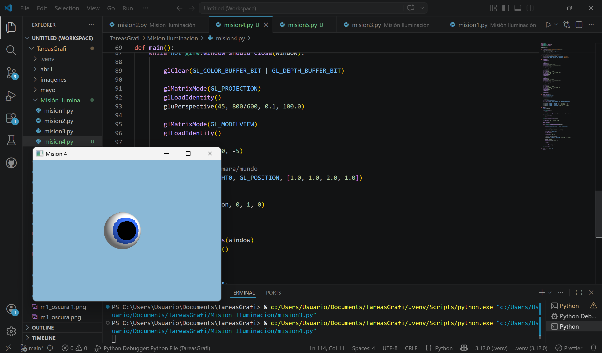
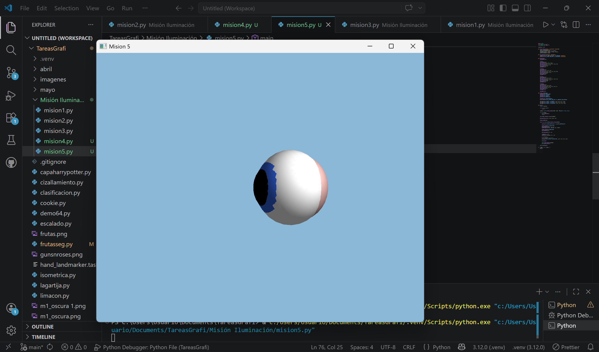
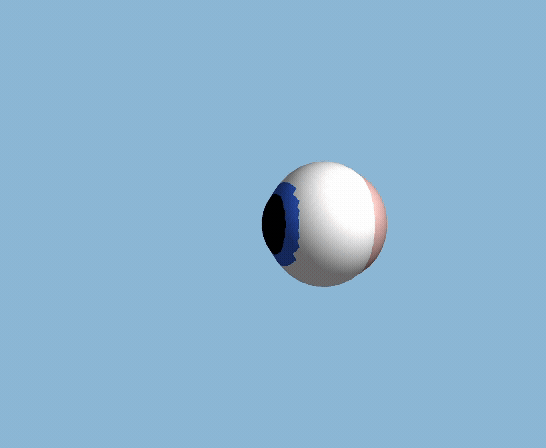

# Práctica: Iluminación y Materiales en OpenGL

## Datos del Alumno

- Nombre: JORGE ALEJANDRO VALENCIA NUÑEZ 24120404
- Materia: Graficación

---

# Objetivo

Implementar iluminación clásica en OpenGL utilizando GLFW y PyOpenGL,
aplicando luces, normales, materiales y brillo especular sobre un modelo 3D.

---

# Misión 1 — Iluminación básica

Se activó el sistema de iluminación de OpenGL utilizando:

- GL_LIGHTING
- GL_LIGHT0
- GL_DEPTH_TEST

También se configuró una luz posicional con componentes:

- ambiental
- difusa
- especular

## Captura



---

# Misión 2 — Normales suaves

Se agregaron normales suaves usando:

```python
gluQuadricNormals(quad, GLU_SMOOTH)
```

Esto permitió una iluminación continua y una apariencia más redondeada.

## Captura



---

# Misión 3 — Materiales

Se aplicaron materiales distintos para:

- piel
- esclerótica
- iris
- pupila

Usando:

- glMaterialfv()
- glMaterialf()

## Captura



---

# Misión 4 — Color Material

Se habilitó:

```python
glEnable(GL_COLOR_MATERIAL)
glColorMaterial(GL_FRONT_AND_BACK, GL_AMBIENT_AND_DIFFUSE)
```

Esto permitió combinar iluminación con glColor3f().

## Captura



---

# Misión 5 — Posición de la luz

Se experimentó con la posición de la luz respecto al objeto.

Dependiendo del momento en que se ejecuta:

```python
glLightfv(GL_LIGHT0, GL_POSITION, ...)
```

la luz puede permanecer fija en cámara o moverse con el objeto.

## Captura



---

# GIF / Animación

La siguiente animación muestra:

- rotación
- iluminación
- brillo especular
- materiales



---

# Tabla Comparativa

| Misión | Mejora visual |
|---|---|
| Misión 1 | Iluminación básica |
| Misión 2 | Sombras suaves |
| Misión 3 | Materiales y brillo |
| Misión 4 | Colores afectados por luz |
| Misión 5 | Control de luz dinámica |

---

# Preguntas de análisis

## ¿Por qué cambia la iluminación al rotar?

La posición de la luz se transforma usando la matriz MODELVIEW activa.
Dependiendo de cuándo se define la luz, esta puede permanecer fija
o moverse junto con el objeto.

---

## ¿Qué función tienen las normales?

Las normales permiten calcular cómo rebota la luz sobre la superficie.
Sin normales correctas, la iluminación se vería incorrecta o plana.

---

## ¿Qué produce el componente especular?

Produce reflejos brillantes que simulan superficies pulidas o húmedas.

---

# Conclusión

Durante esta práctica se implementó iluminación clásica en OpenGL
usando GLFW y PyOpenGL.

Se trabajó con:
- luces
- normales
- materiales
- brillo especular
- color material

Logrando una representación visual más realista del modelo 3D.
