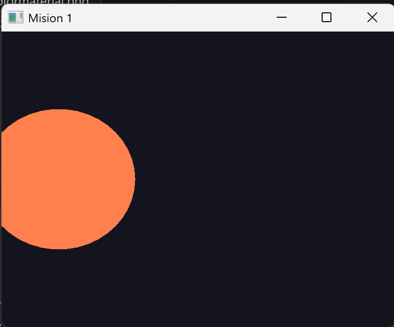
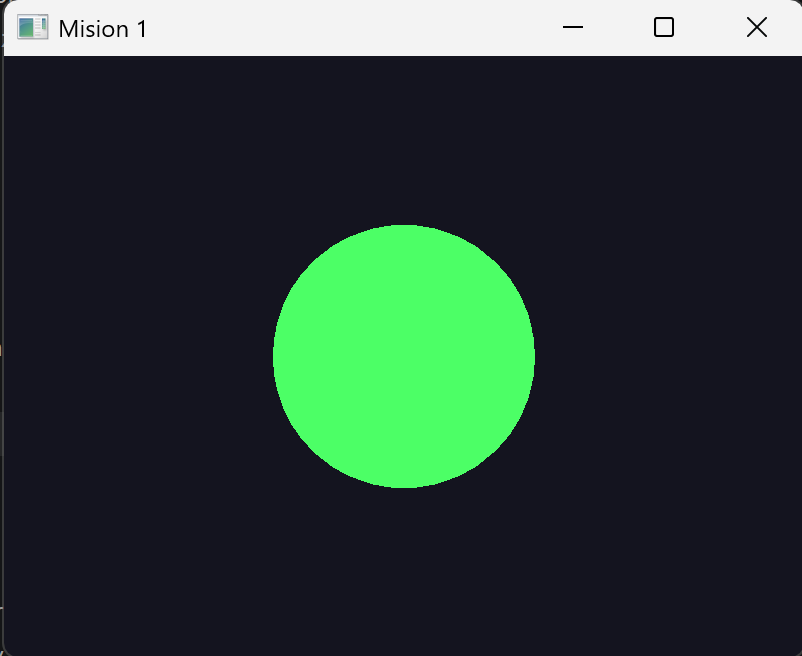
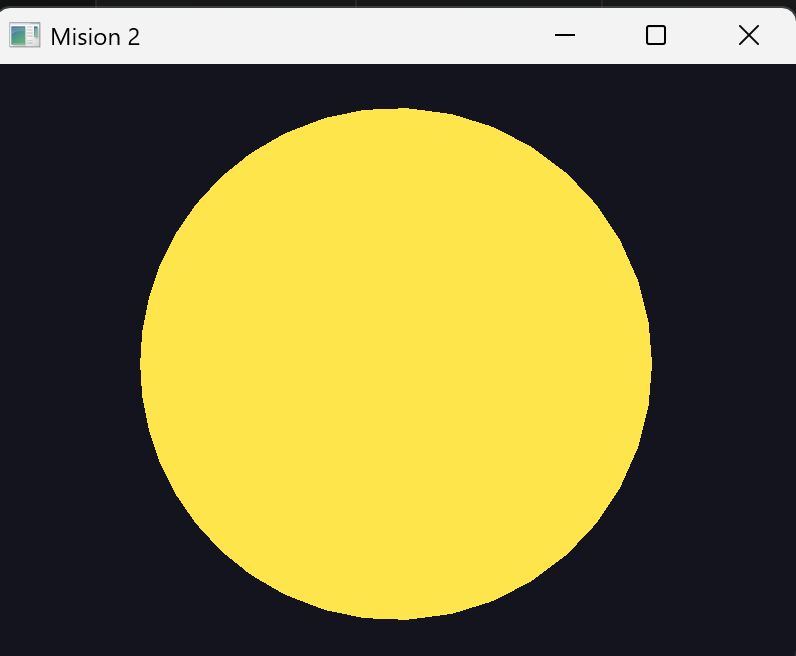
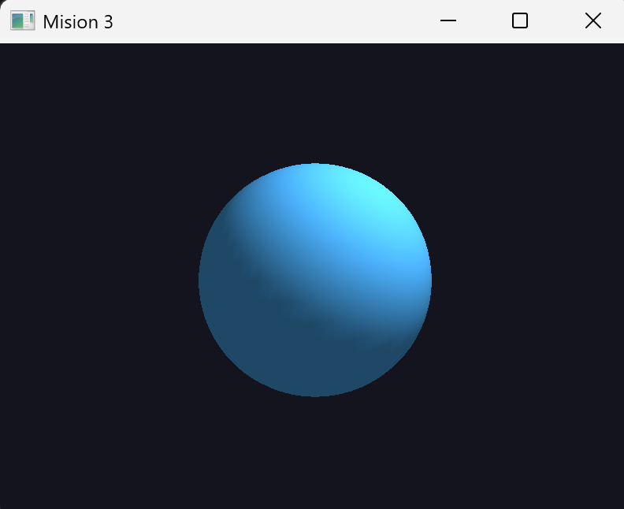

# Reporte de Misión: Órbita Dual (Cámara vs Objeto)
**Agente Especial:** [Jorge Alejandro Valencia Nuñez / 24120404]

---

# Evidencias

## Misión 1

### Objeto rota


### Cámara orbita


### Código

```python
# #!/usr/bin/env python3

from __future__ import annotations

import sys

import glfw
from OpenGL.GL import *
from OpenGL.GLU import *

WINDOW_TITLE = "Mision 1"

CAM_DISTANCE = 5.0
ANGLE_SPEED = 0.6

_quadric = None


def draw_sphere(radius=1.0):

    global _quadric

    if _quadric is None:

        _quadric = gluNewQuadric()

        gluQuadricDrawStyle(
            _quadric,
            GLU_FILL
        )

    gluSphere(
        _quadric,
        radius,
        40,
        24
    )


def render_normal(angle):

    glMatrixMode(GL_MODELVIEW)

    glLoadIdentity()

    glRotatef(
        -angle,
        0.0,
        1.0,
        0.0
    )

    glTranslatef(
        0.0,
        0.0,
        -CAM_DISTANCE
    )

    glColor3f(
        1.0,
        0.5,
        0.3
    )

    draw_sphere()


def render_variant(angle):

    glMatrixMode(GL_MODELVIEW)

    glLoadIdentity()

    glTranslatef(
        0.0,
        0.0,
        -CAM_DISTANCE
    )

    glRotatef(
        angle,
        0.0,
        1.0,
        0.0
    )

    glColor3f(
        0.3,
        1.0,
        0.4
    )

    draw_sphere()


def main():

    if not glfw.init():

        sys.exit(1)

    glfw.window_hint(
        glfw.CONTEXT_VERSION_MAJOR,
        2
    )

    glfw.window_hint(
        glfw.CONTEXT_VERSION_MINOR,
        1
    )

    window = glfw.create_window(
        800,
        600,
        WINDOW_TITLE,
        None,
        None
    )

    glfw.make_context_current(window)

    glEnable(GL_DEPTH_TEST)

    mode = 1

    angle = 0.0

    def on_key(win, key, scancode, action, mods):

        nonlocal mode

        if action != glfw.PRESS:
            return

        if key == glfw.KEY_1:
            mode = 1

        elif key == glfw.KEY_2:
            mode = 2

        elif key == glfw.KEY_ESCAPE:
            glfw.set_window_should_close(
                win,
                True
            )

    glfw.set_key_callback(
        window,
        on_key
    )

    while not glfw.window_should_close(window):

        width, height = glfw.get_framebuffer_size(window)

        glViewport(
            0,
            0,
            width,
            height
        )

        glClearColor(
            0.08,
            0.08,
            0.12,
            1.0
        )

        glClear(
            GL_COLOR_BUFFER_BIT |
            GL_DEPTH_BUFFER_BIT
        )

        glMatrixMode(GL_PROJECTION)

        glLoadIdentity()

        gluPerspective(
            50.0,
            width / float(height),
            0.1,
            100.0
        )

        if mode == 1:

            render_normal(angle)

        else:

            render_variant(angle)

        angle += ANGLE_SPEED

        glfw.swap_buffers(window)

        glfw.poll_events()

    glfw.terminate()


if __name__ == "__main__":
    main()
```

---

## Misión 2

### LookAt órbita


### Código

```python
##!/usr/bin/env python3

from __future__ import annotations

import math
import glfw

from OpenGL.GL import *
from OpenGL.GLU import *

angle = 0.0
mode = 1

quadric = None


def draw_sphere():

    global quadric

    if quadric is None:
        quadric = gluNewQuadric()

    gluSphere(
        quadric,
        1.0,
        40,
        40
    )


def render_scene(radius):

    global angle

    glMatrixMode(GL_MODELVIEW)

    glLoadIdentity()

    a = math.radians(angle)

    cam_x = radius * math.sin(a)
    cam_z = radius * math.cos(a)

    gluLookAt(
        cam_x,
        0.0,
        cam_z,
        0.0,
        0.0,
        0.0,
        0.0,
        1.0,
        0.0
    )

    glColor3f(
        1.0,
        0.9,
        0.3
    )

    draw_sphere()


def on_key(window, key, scancode, action, mods):

    global mode

    if action != glfw.PRESS:
        return

    if key == glfw.KEY_1:
        mode = 1

    elif key == glfw.KEY_2:
        mode = 2

    elif key == glfw.KEY_ESCAPE:
        glfw.set_window_should_close(window, True)


glfw.init()

window = glfw.create_window(
    800,
    600,
    "Mision 2",
    None,
    None
)

glfw.make_context_current(window)

glfw.set_key_callback(window, on_key)

glEnable(GL_DEPTH_TEST)

while not glfw.window_should_close(window):

    width, height = glfw.get_framebuffer_size(window)

    glViewport(0, 0, width, height)

    glClearColor(0.08, 0.08, 0.12, 1.0)

    glClear(
        GL_COLOR_BUFFER_BIT |
        GL_DEPTH_BUFFER_BIT
    )

    glMatrixMode(GL_PROJECTION)

    glLoadIdentity()

    gluPerspective(
        45.0,
        width / float(height),
        0.1,
        100.0
    )

    if mode == 1:

        render_scene(3.0)

    else:

        render_scene(8.0)

    angle += 0.6

    glfw.swap_buffers(window)

    glfw.poll_events()

glfw.terminate()
```

---

## Misión 3 (Opcional)

### Luces


### Notas

- Se activó iluminación con `GL_LIGHT0`.
- La luz cambia el sombreado dependiendo de la posición de cámara y objeto.
- Se observan diferencias visuales entre mover objeto y mover cámara.

### Código

```python
##!/usr/bin/env python3

import glfw

from OpenGL.GL import *
from OpenGL.GLU import *

angle = 0.0

quadric = None


def draw_sphere():

    global quadric

    if quadric is None:
        quadric = gluNewQuadric()

    gluSphere(
        quadric,
        1.0,
        40,
        40
    )


def setup_light():

    glEnable(GL_LIGHTING)

    glEnable(GL_LIGHT0)

    glEnable(GL_COLOR_MATERIAL)

    glColorMaterial(
        GL_FRONT_AND_BACK,
        GL_AMBIENT_AND_DIFFUSE
    )

    ambient = [
        0.2,
        0.2,
        0.2,
        1.0
    ]

    diffuse = [
        1.0,
        1.0,
        1.0,
        1.0
    ]

    glLightfv(
        GL_LIGHT0,
        GL_AMBIENT,
        ambient
    )

    glLightfv(
        GL_LIGHT0,
        GL_DIFFUSE,
        diffuse
    )


def render_scene():

    global angle

    glMatrixMode(GL_MODELVIEW)

    glLoadIdentity()

    glTranslatef(
        0.0,
        0.0,
        -5.0
    )

    light_position = [
        2.0,
        3.0,
        2.0,
        1.0
    ]

    glLightfv(
        GL_LIGHT0,
        GL_POSITION,
        light_position
    )

    glRotatef(
        angle,
        0.0,
        1.0,
        0.0
    )

    glColor3f(
        0.3,
        0.7,
        1.0
    )

    draw_sphere()


glfw.init()

window = glfw.create_window(
    800,
    600,
    "Mision 3",
    None,
    None
)

glfw.make_context_current(window)

glEnable(GL_DEPTH_TEST)

setup_light()

while not glfw.window_should_close(window):

    width, height = glfw.get_framebuffer_size(window)

    glViewport(
        0,
        0,
        width,
        height
    )

    glClearColor(
        0.08,
        0.08,
        0.12,
        1.0
    )

    glClear(
        GL_COLOR_BUFFER_BIT |
        GL_DEPTH_BUFFER_BIT
    )

    glMatrixMode(GL_PROJECTION)

    glLoadIdentity()

    gluPerspective(
        45.0,
        width / float(height),
        0.1,
        100.0
    )

    render_scene()

    angle += 0.6

    glfw.swap_buffers(window)

    glfw.poll_events()

glfw.terminate()
```

---

# Análisis del Analista (Reflexiones Finales)

## 1. Orden de matrices

**¿Por qué en OpenGL fijo el orden en que escribes `glTranslatef` / `glRotatef` cambia el resultado aunque uses los mismos números?**

> Porque OpenGL multiplica las matrices en orden inverso.  
> Cambiar el orden de `translate` y `rotate` modifica completamente el sistema de referencia usado para las transformaciones.  
> Si primero se rota y luego se traslada, el movimiento ocurre respecto al eje rotado.  
> Si primero se traslada y luego se rota, el objeto puede orbitar alrededor del origen.

---

## 2. Objeto vs cámara

**En la práctica, ¿cuándo prefieres rotar el modelo y cuándo orbitar la cámara?**

> Rotar el modelo es útil cuando se quiere inspeccionar o animar directamente un objeto.  
> Orbitar la cámara es mejor para navegación de escenas 3D, visualización de entornos o simulaciones donde el objeto permanece fijo en el mundo.

---

## 3. gluLookAt vs translate+rotate

**¿Qué ventaja tiene describir la cámara con ojo–objetivo–arriba para equipos de desarrollo?**

> `gluLookAt` simplifica la definición de la cámara porque usa una descripción más intuitiva basada en posición, objetivo y dirección arriba.  
> Esto facilita el trabajo en equipo, la lectura del código y el mantenimiento de escenas complejas.

---

## 4. Luces

**Si la luz se define en el frame de la cámara sin reubicarla al mundo, ¿qué artefacto visual esperas al rotar solo el objeto?**

> La iluminación parecerá “pegada” a la cámara.  
> Al rotar el objeto, las sombras y reflejos pueden verse incorrectos o artificiales porque la luz no permanece fija en el mundo 3D.
