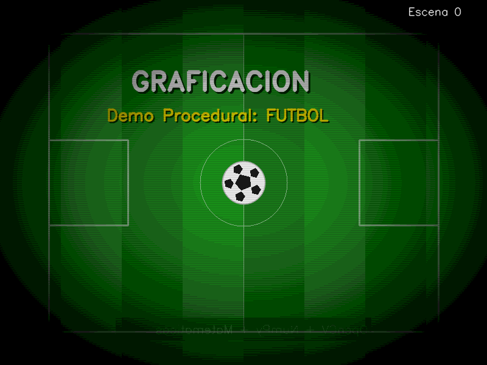
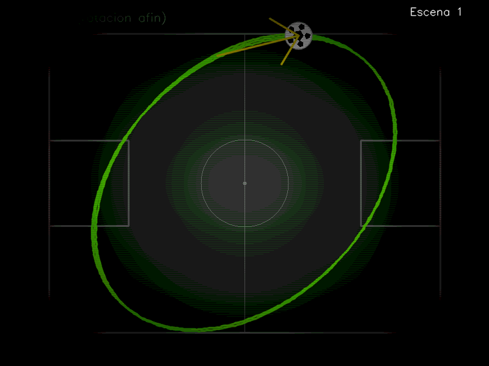
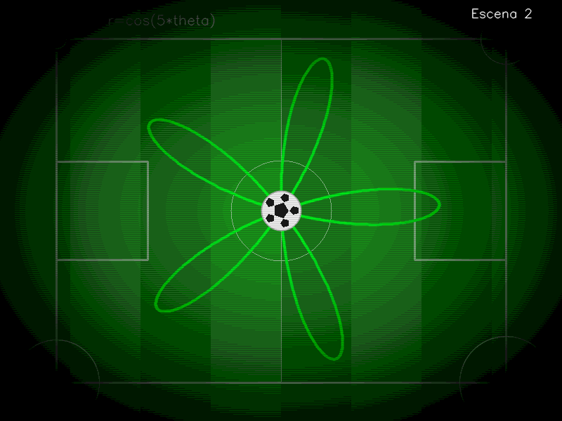
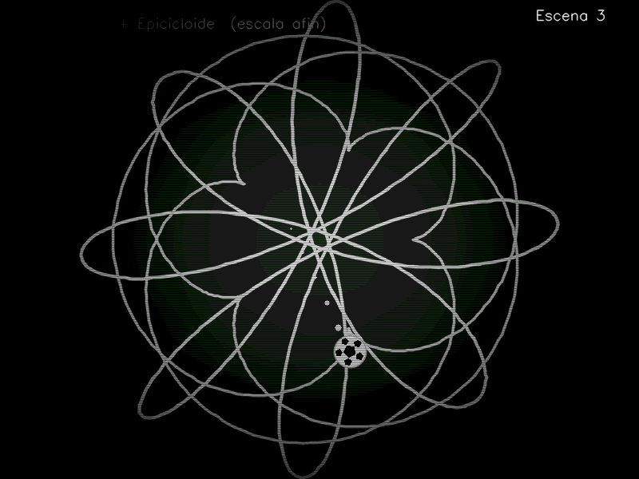
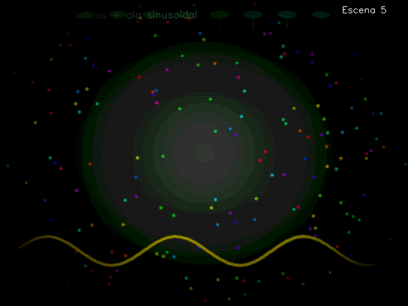

# Proyecto Final — Demo Procedural con OpenCV (Graficación)

---

## Portada

| | |
|---|---|
| **Nombre completo** | Jorge Alejandro Valencia Nuñez |
| **Grupo** | Sistemas |
| **Materia** | Graficación |
| **Proyecto** | Proyecto 1 — Demo Procedural con OpenCV |
| **Tecnologías** | Python 3 · NumPy · OpenCV |
| **Fecha** | Enero–Junio 2026 |

---

## Objetivo de la práctica

Construir una animación procedural en tiempo real utilizando únicamente primitivas de dibujo de OpenCV y operaciones matemáticas con NumPy, sin importar imágenes externas, texturas ni modelos. El demo debe demostrar el uso de:

- Un **timeline** con mínimo 6 escenas controladas por tiempo.
- Mínimo **6 curvas paramétricas distintas** dibujadas con `cv2.polylines`.
- Mínimo **2 transformaciones afines** (traslación / rotación / escala / espejo) aplicadas con matrices 2×3.
- Mínimo **1 filtro o post-efecto** (blur, posterize, vignette, etc.).
- Exportación final como video `.mp4`.

El tema elegido es **fútbol**, con una duración total de **40 segundos** a **30 FPS** y resolución **800×600 px**.

---

## Escenas y Timeline

La animación se divide en 6 bloques de aproximadamente 6–7 segundos. Las transiciones entre escenas usan `cv2.addWeighted` con una función `smoothstep` para lograr un crossfade suave.

| Bloque | Escena | Tiempo | Descripción |
|--------|--------|--------|-------------|
| 0 | Credits / Intro | 0–5 s | Cancha con líneas de campo, pelota pulsante animada con seno, título con sombra y subtítulo con efecto espejo (`cv2.flip`). |
| 1 | Lissajous Ball | 5–13 s | Pelota siguiendo una curva de Lissajous con parámetros dinámicos. Toda la curva y la pelota se rotan con matriz afín 2×3. |
| 2 | Rosa Polar | 13–21 s | Vista aérea de la cancha. Curva rosa polar `r = cos(5θ)` girando en tiempo real. Círculos animados en los 4 tiros de esquina. |
| 3 | Spirograph Kick | 21–29 s | Hipotrocoide + epicicloide sobre fondo de estadio. Escala afín pulsante. Pelota siguiendo una parábola de "chutazo" con estela. |
| 4 | Fuego de Gol | 29–37 s | Sistema de partículas tipo fuego (heatmap + difusión gaussiana). Texto "GOOOL!!!" pulsante con color HSV animado. |
| 5 | Partículas Estadio | 37–40 s | Lluvia de confeti RGB, luces de tribuna con `ellipse`, ola sinusoidal del estadio. |

---

## Capturas de pantalla

> Las capturas se encuentran en la carpeta `renders/` y fueron generadas con `capture_frames.py` en el instante más representativo de cada escena.

### Escena 0 — Credits / Intro


*Cancha procedural con líneas de campo, pelota pulsante en el centro y título animado. El subtítulo aplica espejo horizontal con `cv2.flip`.*

---

### Escena 1 — Lissajous Ball


*Curva de Lissajous con parámetros `a` y `b` que varían con el tiempo. La pelota recorre la trayectoria y toda la figura rota aplicando una matriz de rotación afín 2×3.*

---

### Escena 2 — Rosa Polar


*Rosa polar `r = cos(5θ)` que gira sobre el centro de la cancha. En las 4 esquinas se dibujan círculos parametrizados con radio oscilante (tiros de corner).*

---

### Escena 3 — Spirograph Kick


*Hipotrocoide y epicicloide escaladas con una matriz afín pulsante. La pelota sigue una trayectoria parabólica con estela de puntos decrecientes.*

---

### Escena 4 — Fuego de Gol


*Sistema de fuego procedural basado en heatmap con difusión gaussiana y ascenso de calor. El texto "GOOOL!!!" escala con una función seno.*

---

### Escena 5 — Partículas Estadio


*Campo de confeti con movimiento sinusoidal, luces de tribuna con `cv2.ellipse` y ola sinusoidal que recorre la parte inferior.*

---

## Curvas paramétricas implementadas

Se implementaron **6 curvas paramétricas distintas**, todas dibujadas con `cv2.polylines` a partir de puntos calculados con NumPy.

### Curva 1 — Lissajous (Escena 1)

$$x(t) = \sin(a \cdot t + \delta), \quad y(t) = \sin(b \cdot t)$$

donde los parámetros varían con el tiempo global $T$:

$$a = 3 + 0.5\sin(T \cdot 0.5), \quad b = 2 + 0.5\cos(T \cdot 0.7), \quad \delta = \frac{\pi}{2} + 0.3\sin(T \cdot 0.4)$$

### Curva 2 — Rosa Polar (Escena 2)

$$r(\theta) = \cos(k \cdot \theta), \quad k = 5$$
$$x(\theta) = r \cdot \cos(\theta + \theta_0), \quad y(\theta) = r \cdot \sin(\theta + \theta_0)$$

### Curva 3 — Círculo / tiro de esquina (Escena 2)

$$x(\theta) = c_x + r(T)\cos(\theta), \quad y(\theta) = c_y + r(T)\sin(\theta)$$
$$r(T) = 40 + 28\sin(T \cdot 1.6 + i), \quad i \in \{0,1,2,3\}$$

### Curva 4 — Hipotrocoide (Escena 3)

$$x(t) = (R - r)\cos(t) + d\cos\!\left(\frac{R-r}{r}t\right)$$
$$y(t) = (R - r)\sin(t) - d\sin\!\left(\frac{R-r}{r}t\right)$$

con $R = 8$, $r = 3$, $d = 5$.

### Curva 5 — Epicicloide (Escena 3)

$$x(t) = (R_2 + r_2)\cos(t) - r_2\cos\!\left(\frac{R_2+r_2}{r_2}t\right)$$
$$y(t) = (R_2 + r_2)\sin(t) - r_2\sin\!\left(\frac{R_2+r_2}{r_2}t\right)$$

con $R_2 = 5$, $r_2 = 3$.

### Curva 6 — Sinusoide / ola del estadio (Escena 5)

$$y(x) = H \cdot 0.82 + A \cdot \sin(0.025x + T \cdot 3)$$
$$A = 32 + 18\sin(T \cdot 1.3)$$

---

## Transformaciones afines implementadas

Todas las transformaciones se aplican mediante matrices afines 2×3 con la función:

```python
def apply_affine(pts_nx2, M):
    ones = np.ones((len(pts_nx2), 1), dtype=np.float32)
    hom  = np.hstack([pts_nx2.astype(np.float32), ones])
    return (M @ hom.T).T.astype(np.int32)
```

### Transformación 1 — Rotación 2D (Escena 1)

$$M_{rot} = \begin{pmatrix} \cos\theta & -\sin\theta & c_x(1-\cos\theta)+c_y\sin\theta \\ \sin\theta & \cos\theta & c_y(1-\cos\theta)-c_x\sin\theta \end{pmatrix}$$

Se aplica con $\theta = T \cdot 0.25$ rad/s sobre todos los puntos de la curva de Lissajous y sobre la posición de la pelota, rotando el conjunto respecto al centro de la pantalla $(c_x, c_y)$.

### Transformación 2 — Escala afín pulsante (Escena 3)

$$M_{scale} = \begin{pmatrix} s_x & 0 & c_x(1-s_x) \\ 0 & s_y & c_y(1-s_y) \end{pmatrix}$$

con $s_x = s_y = 1 + 0.4\sin(T \cdot 1.1)$, oscilando entre 0.6 y 1.4. Se aplica a la hipotrocoide y la epicicloide creando un efecto de "respiración" del spirograph.

### Transformación 3 — Espejo horizontal (Escena 0)

```python
flip = cv2.flip(sub, 1)   # flipCode = 1 → espejo en eje Y
```

El subtítulo de créditos se genera en un buffer auxiliar, se voltea horizontalmente y se mezcla sobre el frame con `addWeighted`.

---

## Filtros y Post-FX aplicados

Se aplican **3 efectos** a cada frame, en este orden, después de renderizar la escena.

### Post-FX 1 — Viñeta radial

```python
mask = clip(1.0 − strength · (nx² + ny²), 0, 1)
frame = frame * mask
```

Oscurece los bordes de forma radial, concentrando la atención en el centro. `strength = 0.72`.

### Post-FX 2 — Scanlines retro

```python
m = 1.0 − strength · (0.5 + 0.5 · sin(2π · y / 3))
```

Multiplica cada fila por un factor sinusoidal. Simula las líneas de un monitor CRT. `strength = 0.14`.

### Post-FX 3 — Posterización

```python
frame = (frame // q) * q    # q = 24
```

Cuantiza los canales de color, reduciendo tonos continuos a bandas bien definidas.

---

## Tabla comparativa de resultados

| Criterio | Requerimiento mínimo | Implementado | Detalle |
|----------|---------------------|--------------|---------|
| Resolución | 800×600 px | ✅ 800×600 px | Constantes `W=800`, `H=600` |
| FPS | 30 FPS | ✅ 30 FPS | `FPS = 30` |
| Duración | 30–60 s | ✅ 40 s | `DURATION = 40.0` |
| Escenas | Mínimo 6 | ✅ 6 escenas | Credits, Lissajous, Rosa, Spirograph, Fuego, Partículas |
| Curvas paramétricas | Mínimo 6 | ✅ 6 curvas | Lissajous, Rosa polar, Círculo, Hipotrocoide, Epicicloide, Seno |
| Transformaciones afines | Mínimo 2 | ✅ 3 transformaciones | Rotación, Escala, Espejo |
| Post-FX | Mínimo 1 | ✅ 3 efectos | Viñeta, Scanlines, Posterización |
| Primitivas visibles | Sí | ✅ | `line`, `circle`, `ellipse`, `fillPoly`, `putText`, `arrowedLine` |
| Transiciones | Sí | ✅ | `addWeighted` + `smoothstep` entre cada escena |
| Export `.mp4` | Sí | ✅ | `cv2.VideoWriter` → `demo_futbol.mp4` |
| Sin imágenes externas | Prohibido usar | ✅ | 100% procedural, sin archivos `.png/.jpg` importados |
| Lenguaje | Python 3 | ✅ | Python 3 + NumPy + OpenCV únicamente |

---

## Preguntas de análisis

**¿Por qué se usan matrices afines 2×3 en lugar de 3×3?**

En gráficos 2D, una matriz 3×3 homogénea incluye una fila `[0, 0, 1]` que siempre es constante. OpenCV y la implementación manual usan la versión compacta 2×3 que ya asume esa fila, lo que reduce operaciones redundantes. Se aprovecha al agregar una columna de unos al array de puntos para multiplicar directamente con `M @ hom.T`.

**¿Qué ventaja tiene `smoothstep` frente a una interpolación lineal en las transiciones?**

`smoothstep` produce una curva con segunda derivada continua (empieza y termina con velocidad cero), lo que elimina el "salto" visual en el inicio y fin de cada transición. Una interpolación lineal generaría un cambio abrupto de velocidad que el ojo percibe como corte.

**¿Por qué la rosa polar con `k = 5` produce 5 pétalos y no 10?**

Cuando `k` es impar en `r = cos(k·θ)`, la curva produce exactamente `k` pétalos porque cada pétalo se traza en el intervalo `[0, π]` y se repite simétricamente sin añadir pétalos adicionales. Con `k` par se producirían `2k` pétalos.

**¿Cómo funciona el sistema de fuego procedural?**

Se mantiene una matriz `heat` de flotantes que representa temperatura por píxel. En cada frame se añaden fuentes de calor aleatorias en la franja inferior, luego se difunde el calor con `GaussianBlur`, y finalmente se desplaza la matriz una fila hacia arriba (simulando el ascenso del calor). Los valores de calor se mapean al espacio de color HSV: frío → negro/rojo, caliente → amarillo/blanco.

**¿Qué diferencia hay entre hipotrocoide y epicicloide?**

Ambas son curvas generadas por un punto en una rueda que rueda sobre un círculo base. La diferencia es la posición: en la **hipotrocoide** la rueda pequeña rueda por el **interior** del círculo base (`R - r`), mientras que en la **epicicloide** rueda por el **exterior** (`R + r`). Esto produce familias de formas completamente distintas con los mismos parámetros `R` y `r`.

---

## Conclusión final

El desarrollo del Demo Procedural de Fútbol permitió poner en práctica de forma integrada los conceptos centrales de la materia de Graficación. A través de seis escenas completamente distintas se demostró que es posible generar animaciones complejas y visualmente ricas utilizando únicamente matemáticas, NumPy y las primitivas de dibujo de OpenCV, sin recurrir a ningún recurso externo.

Las curvas paramétricas (Lissajous, rosa polar, hipotrocoide, epicicloide, círculo y sinusoide) mostraron cómo ecuaciones relativamente simples pueden producir geometrías elaboradas cuando se combinan con animación en el tiempo. Las transformaciones afines confirmaron su utilidad para manipular conjuntos completos de puntos de forma eficiente con una sola multiplicación matricial. Los post-efectos (viñeta, scanlines y posterización) demostraron que el procesamiento de imagen por píxel puede elevar significativamente la calidad visual de una animación procedural con un costo computacional mínimo.

El proyecto también reforzó hábitos de programación importantes: separar la lógica en funciones independientes por escena, manejar el estado mínimo necesario, y usar buffers dobles para las transiciones sin afectar el frame en renderizado.

---

*Jorge Alejandro Valencia Nuñez — Sistemas — Graficación — Enero-Junio 2026*